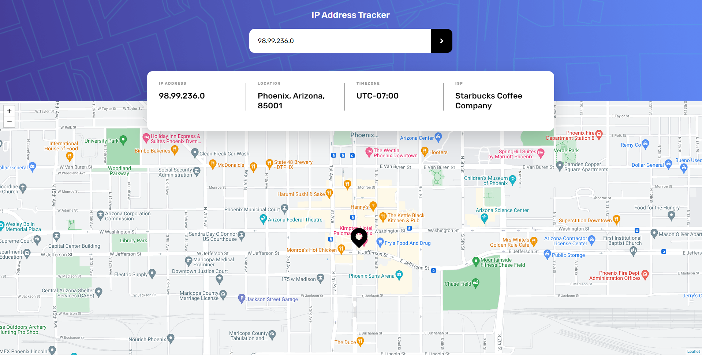

# Frontend Mentor - IP address tracker solution

This is a solution to the [IP address tracker challenge on Frontend Mentor](https://www.frontendmentor.io/challenges/ip-address-tracker-I8-0yYAH0). Frontend Mentor challenges help you improve your coding skills by building realistic projects.

## Table of contents

- [Overview](#overview)
  - [The challenge](#the-challenge)
  - [Screenshot](#screenshot)
  - [Links](#links)
- [My process](#my-process)
  - [Built with](#built-with)
- [Author](#author)
- [Acknowledgments](#acknowledgments)

## Overview

### The challenge

Users should be able to:

- View the optimal layout for each page depending on their device's screen size
- See hover states for all interactive elements on the page
- See their own IP address on the map on the initial page load
- Search for any IP addresses or domains and see the key information and location

### Screenshot

### Links

- Solution URL: (https://github.com/Dantedavidson/IP-Address-Geolocation)
- Live Site URL: (https://stoic-lalande-32d355.netlify.app/)

## My process

### Built with

- CSS custom properties
- Flexbox
- Mobile-first workflow
- Javascript
- Leaflet

## Author

- Frontend Mentor - [@Dantedavidson](https://www.frontendmentor.io/profile/Dantedavidson)
- LinkedIn - [@Dante Davidson Daniele](https://www.linkedin.com/in/dante-davidson-daniele-54a1ab213/)
- Github - [@Dantedavidson] (https://github.com/Dantedavidson)

## Acknowledgments

In the spirit of reconciliation I acknowledge the Traditional Custodians of country throughout Australia and their connections to land, sea and community. I pay my respect to their elders past and present and extend that respect to all Aboriginal and Torres Strait Islander peoples today.
